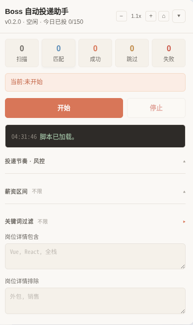

# Boss 直聘自动投递油猴脚本

专为 Boss 直聘职位列表页设计的 Tampermonkey / 篡改猴自动投递脚本。专注于**真实投递与安全防风控**,去除了繁琐的配置,只保留最核心的岗位详情筛选。

> v0.2 起使用 **TypeScript + Vite + vite-plugin-monkey** 构建,源码拆分到 `src/`,构建产物为单文件 `dist/boss-auto-apply.user.js`。

## 鸣谢 🙏

本项目是 [muyuniao/boss-auto-apply](https://github.com/muyuniao/boss-auto-apply) 的 fork。原作者把核心逻辑写得非常扎实 —— 投递 API 调用、Vue 反射取值、过滤规则、风控默认参数都开箱即用,脚本本身就很好用。

本 fork 只在原版基础上做了两件事:

- **UI 重做**:按 Claude 风格重画面板(配色 / 字号 / 缩放 / 可折叠分组)
- **新增薪资过滤**:解析 `10-15K·15薪` / `1-2万` / `面议` 等格式,支持上下限区间过滤

其余逻辑(投递、详情接口、风控默认值、长尾暂停等)都是原作者的设计,**插件非常好用,推荐优先使用原作者版本**。本 fork 主要面向想在原作者基础上做 UI 调整或想加薪资过滤的同学。


## 安装与使用

1. 在浏览器中安装 **Tampermonkey / 篡改猴** 插件。
2. 取 `dist/boss-auto-apply.user.js` 拖进 Tampermonkey 安装,或复制全部内容手动新建脚本。
3. 自行登录 Boss 直聘网页版。
4. 打开职位列表页(例如 `https://www.zhipin.com/web/geek/job`)。
5. 右下角自动挂载「Boss 自动投递助手」面板,设置好筛选条件后点击「开始」。

## 开发

```bash
npm install        # 安装依赖
npm run dev        # 开发模式(监听变更 + 出包)
npm run build      # 生产构建 → dist/boss-auto-apply.user.js
npm run check      # 仅做 TypeScript 类型检查
```

## 核心特性

- **无感自动保存**:面板上任何改动即时保存,不丢焦点。
- **安全默认**:`skipHeadhunter`、`treatChatRemindAsSuccess`、`fetchDetail`、`skipAppliedHistory` 默认开启。
- **可调防封参数**(面板上直接设置,不再硬锁):
  - `dailyLimit` —— 每日投递上限
  - `delayMinSec` / `delayMaxSec` —— 单次投递间隔区间(秒)
  - `pageDelaySec` —— 翻页/滚动后等待
  - `longPauseChance` —— **长尾暂停概率**(默认 15%):每次投递按此概率触发一次 12–25s 的"长暂停",模拟真人"看完 JD 再投"节奏,降低被风控识别的概率
  - `activeWithinDays` —— BOSS 活跃天数阈值
- **新增薪资过滤**:
  - `salaryMinK` / `salaryMaxK` —— 区间过滤(以 K 为单位,0 = 不限)
  - 自动解析 `10-15K·15薪` / `1-2万` / `8千-1.2万` / `100-150元/天` / `100元/小时` 等格式
  - 日薪/时薪自动按 22 工作日/月、8 小时/天换算成 K/月,兼职也能被 `salaryMinK` 过滤
  - `面议` 在设置了过滤区间时默认跳过(保守策略)
- **固定 150 份每日上限** 的硬锁已**移除**,现在由用户在面板上控制(默认仍是 150)。
- **预演模式**(运行 Tab 顶部开关):开启后只扫描+过滤,不实际调用投递接口,不消耗每日额度,适合调过滤规则时预览。
- **统计 Tab**:从 `records` 聚合展示 —— TOP 20 公司、薪资分布直方图、跳过原因饼图(纯 CSS 可视化,不引图表库)。

## 源码结构

```
src/
├── globals.d.ts          GM_* API 类型声明
├── main.ts               入口/bootstrap
├── types.ts              全局类型 + DEFAULT_CONFIG
├── config.ts             配置加载/规范化
├── gm.ts                 GM 存储封装 + 请求头
├── history.ts            当天投递历史(去重/计数)
├── debug.ts              日志/通知
├── dom.ts                文本工具/选择器/Vue 反射取值
├── job.ts                卡片解析/唯一键/活跃天数
├── salary.ts             ⭐ 薪资解析
├── filters.ts            过滤规则组合
├── api.ts                fetch 详情 + 投递接口
├── loop.ts               主循环/翻页/启停
├── route.ts              SPA 路由监听
└── ui/
    ├── styles.ts         CSS
    └── panel.ts          面板渲染 + 事件
```

## 注意事项

- 自动投递使用的是您当前浏览器登录的 Boss 页面原生接口,脚本**绝不**收集或上传您的个人数据或密码。
- 脚本不会突破、绕过 Boss 官方的滑块验证码或账号风控。触发风控请降低 `dailyLimit` 并调大 `delayMinSec` / `delayMaxSec`。
- 如果提示"今日沟通上限"或触发风控,脚本会自动结束。

## 📸 运行效果

Claude 风格面板(本 fork 重做版):



运行中:5 项统计实时更新,日志区滚动显示每条操作。
